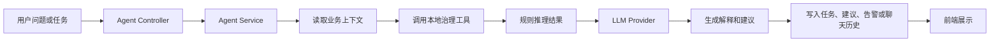
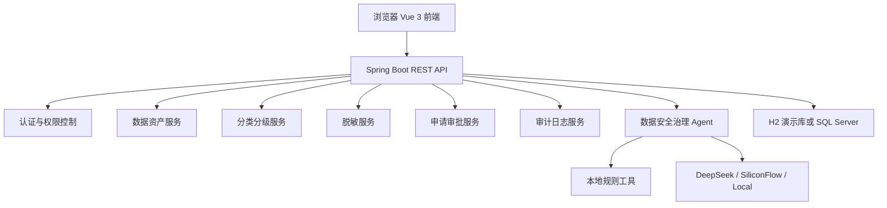
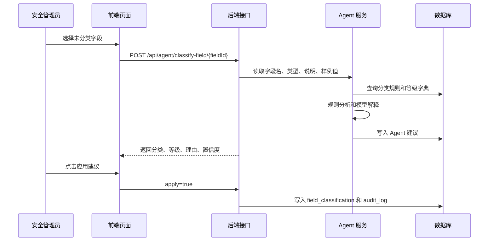
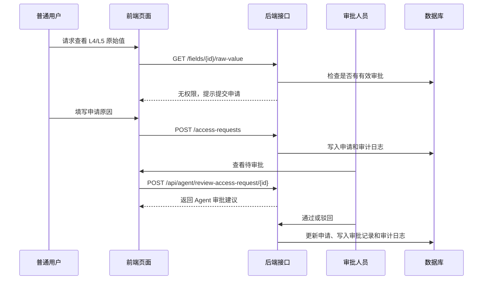
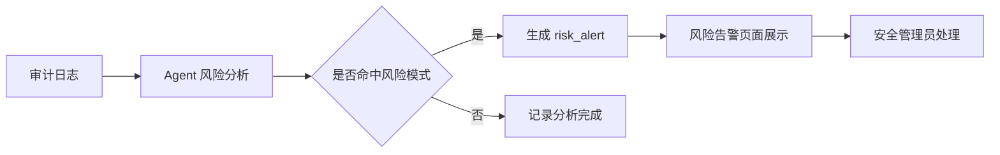

# 数据分类分级保护系统最终成品设计文档

## 1. 文档说明

本文档描述《数据分类分级保护系统》的最终成品形态，用于指导项目实现、课程答辩展示和后续扩展。系统最终应呈现为一个面向企业数据安全治理场景的 Web 平台，覆盖数据资产登记、数据分类分级、敏感数据脱敏、访问申请审批、审计留痕、统计看板和数据安全治理 Agent。

最终成品要体现一条完整闭环：资产登记、分类分级、脱敏访问、申请审批、审计分析、Agent 辅助治理、持续整改。

## 2. 产品定位

系统名称：数据分类分级保护系统

产品定位：面向企业数据安全管理员、审批人员和普通业务用户的数据安全治理平台。

核心目标：

1. 建立统一的数据资产台账。
2. 对字段级数据进行分类分级。
3. 对敏感数据访问进行脱敏、审批和审计。
4. 用 Agent 辅助完成分类建议、审批建议、风险分析和报告生成。
5. 形成“资产识别、分类分级、访问控制、审计分析、持续整改”的治理闭环。

## 3. 用户角色设计

| 角色 | 典型用户 | 核心权限 |
| --- | --- | --- |
| 系统管理员 admin | 平台维护人员 | 用户管理、资产管理、全部配置和全部数据查看 |
| 安全管理员 security_admin | 数据安全负责人 | 分类分级、规则配置、脱敏策略、风险分析、安全报告 |
| 审批人员 approver | 部门主管或数据负责人 | 查看访问申请、审批或驳回高敏数据访问 |
| 普通用户 user | 业务使用人员 | 查看授权范围内字段、提交高敏字段访问申请、查看本人申请 |

## 4. 最终页面形态设计

### 4.1 整体布局

最终成品采用后台管理系统布局：

1. 顶部区域显示系统名称、当前登录用户、角色和退出按钮。
2. 左侧菜单按业务模块分组。
3. 中间主区域展示当前功能页面。
4. 右下角常驻悬浮 AI 助手按钮。
5. 弹出的 AI 助手窗口不跳转页面，可在任何功能页上使用。

推荐页面结构：

```text
┌──────────────────────────────────────────────────────────────┐
│ 数据分类分级保护系统                  当前用户 / 角色 / 退出 │
├───────────────┬──────────────────────────────────────────────┤
│ 首页看板       │                                              │
│ 数据资产       │                 主内容区域                    │
│ 分类分级       │                                              │
│ 规则管理       │                                              │
│ 脱敏策略       │                                              │
│ 访问申请       │                                              │
│ 审批管理       │                                              │
│ 审计日志       │                                              │
│ Agent 工作台   │                                      [AI]    │
└───────────────┴──────────────────────────────────────────────┘
```

### 4.2 视觉风格

系统视觉应偏向企业安全治理平台，强调清晰、可信、可操作。

| 设计项 | 建议 |
| --- | --- |
| 主色 | 科技蓝，用于导航、主按钮和关键链接 |
| 辅色 | 绿色表示安全或通过，橙色表示中风险，红色表示高风险 |
| 页面密度 | 中高密度，适合表格、筛选、统计卡片和审计列表 |
| 卡片风格 | 轻量卡片，圆角不宜过大，避免复杂装饰 |
| 风险表达 | 使用标签、颜色和图标共同表达，不只依赖颜色 |

### 4.3 首页看板

首页用于展示系统整体治理状态，进入系统后应第一眼看到：

1. 数据源数量。
2. 数据表数量。
3. 字段资产数量。
4. 敏感字段数量。
5. L3/L4/L5 高敏字段数量。
6. 待审批申请数量。
7. 未处理风险告警数量。
8. 最近审计日志。

首页还应提供快捷入口：新增字段资产、执行自动分类、查看待审批申请、打开 Agent 工作台。

### 4.4 数据资产页面

数据资产模块包含三个页面：

1. 数据源管理：维护数据源名称、类型、地址、数据库名、说明。
2. 数据表管理：维护数据表名、业务名称、归属数据源、表说明。
3. 字段资产管理：维护字段名、字段类型、字段说明、样例值、是否敏感。

字段资产页面是核心页面，应支持按数据源、数据表、字段名、是否敏感筛选，支持新增、编辑、删除字段，支持查看脱敏样例值，对 L4/L5 字段申请查看原始值，并可一键跳转到字段智能分类。

### 4.5 分类分级页面

分类分级页面用于展示每个字段的分类结果。

页面应包含字段名、表名、分类、等级、分类方式、分类理由、更新时间，并提供人工分类、规则自动分类和 Agent 分类入口。

等级建议：

| 等级 | 含义 | 示例 |
| --- | --- | --- |
| L1 | 公开数据 | 商品名称、公开公告 |
| L2 | 内部数据 | 内部编号、普通业务字段 |
| L3 | 敏感数据 | 手机号、邮箱、地址 |
| L4 | 高敏数据 | 身份证号、银行卡号 |
| L5 | 极高敏数据 | 密码、密钥、认证凭据 |

### 4.6 规则与脱敏页面

规则管理页面用于维护自动识别规则：keyword 规则按字段名关键词匹配，regex 规则按字段名或样例值正则匹配。每条规则绑定分类和等级，并支持启用、禁用和优先级。

脱敏策略页面用于展示不同类型敏感数据的脱敏方式：

| 类型 | 示例原始值 | 示例脱敏值 |
| --- | --- | --- |
| 手机号 | 13812345678 | 138****5678 |
| 邮箱 | user@example.com | u***@example.com |
| 身份证 | 510123199901011234 | 510123********1234 |
| 银行卡 | 6222020202020202020 | 6222************2020 |
| 密码密钥 | secret123 | ****** |

### 4.7 访问申请与审批页面

普通用户访问 L4/L5 字段原始值时，系统不应直接返回原始值，而是引导用户提交访问申请。

访问申请页面应包含申请字段、申请原因、申请状态、有效期和审批意见。

审批页面应包含申请人、字段分类分级、申请原因、历史访问记录、Agent 审批建议，以及通过、驳回操作。

### 4.8 审计日志页面

审计日志页面用于追踪关键操作，支持按用户、操作类型、时间和结果筛选。

需要记录的操作包括用户登录、查看字段、查看脱敏值、申请查看原始值、审批通过或驳回、修改分类分级、执行 Agent 分析和处理风险告警。

## 5. 数据安全治理 Agent 设计

### 5.1 Agent 定位

系统新增“数据安全治理 Agent”，定位为安全管理员的智能辅助工具。Agent 不直接绕过系统权限，不直接修改高风险数据，它的职责是分析、建议、解释和生成报告。

Agent 的核心能力：

1. 字段智能分类。
2. 高敏访问审批建议。
3. 审计日志风险分析。
4. 安全治理报告生成。
5. 自然语言问答。
6. 悬浮 AI 助手。

### 5.2 Agent 页面组成

| 页面 | 路由 | 作用 |
| --- | --- | --- |
| Agent 工作台 | `/agent` | 展示 Agent 任务、建议、风险、快捷操作 |
| 字段智能分类 | `/agent/field-classify` | 对未分类字段生成分类分级建议 |
| 审批建议 | `/agent/approval-advice` | 对访问申请生成通过、驳回或人工复核建议 |
| 风险告警 | `/agent/risk-alerts` | 分析审计日志并生成风险告警 |
| 安全报告 | `/agent/security-report` | 生成 Markdown 安全治理报告 |
| Agent 问答 | `/agent/chat` | 独立聊天页面 |
| 悬浮 AI 助手 | 全局页面右下角 | 任意页面可打开的轻量问答入口 |

### 5.3 悬浮 AI 助手设计

悬浮助手是最终成品的重要交互亮点。

入口形态：登录后右下角显示圆形 `AI` 按钮，点击后展开聊天面板。面板固定在页面右下角，不影响当前页面操作。

面板内容：

1. 顶部显示“数据安全治理助手”。
2. 支持选择模型通道：本地规则、DeepSeek 官方 API、硅基流动 API。
3. 支持填写模型名，例如 `deepseek-v4-flash`、`deepseek-v4-pro`、`deepseek-ai/DeepSeek-V3.2`。
4. 中间展示对话记录。
5. 底部输入问题和发送按钮。
6. 失败时显示清晰错误信息，并提示可切换本地规则。

典型问题：

1. 当前系统有多少高敏字段？
2. 哪些字段还没有完成分类？
3. 最近有哪些高风险访问行为？
4. 为什么这个访问申请建议驳回？
5. 请生成一份数据安全整改建议。

### 5.4 Agent 执行模型

Agent 采用“上下文获取、工具分析、模型生成、结果落库”的执行方式。



本地治理工具包括字段分类工具、访问审批分析工具、审计风险分析工具、安全报告生成工具和资产统计查询工具。

LLM Provider 支持：

1. local：本地规则推理，离线可用。
2. deepseek：DeepSeek 官方 OpenAI-compatible API。
3. siliconflow：硅基流动 OpenAI-compatible API。

最终实现建议：

1. 后端保留统一接口 `POST /api/agent/chat`。
2. 前端不直接访问外部大模型 API。
3. API Key 只通过后端环境变量读取。
4. Agent 输出必须结合当前系统数据，不做脱离数据库上下文的空泛回答。
5. 外部模型不可用时自动回退到本地规则。

### 5.5 Agent 安全约束

Agent 不能突破系统原有权限边界：

1. 普通用户不能通过 Agent 查看未授权原始敏感值。
2. Agent 可以解释审批建议，但不能替审批人自动通过申请。
3. Agent 可以建议分类分级，是否应用由用户确认。
4. Agent 的所有关键操作需要写入 `agent_task` 或 `agent_chat_history`。
5. 生成风险告警后，必须由安全管理员人工处理。

## 6. 技术架构设计

### 6.1 总体架构



### 6.2 后端技术栈

| 技术 | 用途 |
| --- | --- |
| Java 17 | 后端开发语言 |
| Spring Boot 3 | 应用框架 |
| Spring Web | REST API |
| Spring JDBC | 数据访问 |
| Spring Security | 登录认证和接口保护 |
| H2 | 本地演示数据库 |
| SQL Server | 课程设计主数据库脚本 |
| LangChain4j | Agent 和 OpenAI-compatible 模型调用编排 |

### 6.3 前端技术栈

| 技术 | 用途 |
| --- | --- |
| Vue 3 | 前端框架 |
| Vite | 开发和构建工具 |
| Element Plus | 表单、表格、弹窗、按钮等 UI 组件 |
| Axios | HTTP 请求 |
| Vue Router | 页面路由 |

## 7. 数据库设计

数据库设计按业务域分为六组。

1. 用户权限域：`sys_user`、`sys_role`、`sys_permission`、`sys_user_role`、`sys_role_permission`。
2. 数据资产域：`data_source`、`data_table_asset`、`data_field_asset`。
3. 分类分级域：`classification_category`、`classification_level`、`classification_rule`、`field_classification`。
4. 访问控制域：`masking_policy`、`access_request`、`approval_record`。
5. 审计域：`audit_log`。
6. Agent 域：`agent_task`、`agent_recommendation`、`risk_alert`、`agent_chat_history`。

## 8. 核心业务流程

### 8.1 字段分类流程



### 8.2 高敏字段访问流程



### 8.3 审计风险分析流程



## 9. 接口设计

系统接口统一以 `/api` 为前缀。

| 模块 | 方法与路径 | 说明 |
| --- | --- | --- |
| 认证 | `POST /api/auth/login` | 用户登录 |
| 认证 | `GET /api/auth/me` | 获取当前用户 |
| 数据源 | `GET/POST /api/data-sources` | 查询或新增数据源 |
| 数据表 | `GET/POST /api/tables` | 查询或新增数据表 |
| 字段 | `GET/POST /api/fields` | 查询或新增字段 |
| 字段 | `GET /api/fields/{id}/masked-value` | 查看脱敏样例值 |
| 字段 | `GET /api/fields/{id}/raw-value` | 查看原始样例值 |
| 分类 | `GET/POST /api/field-classifications` | 查询或维护分类结果 |
| 分类 | `POST /api/field-classifications/auto-classify` | 执行规则自动分类 |
| 规则 | `GET/POST /api/rules` | 查询或维护分类规则 |
| 申请 | `GET/POST /api/access-requests` | 查询或提交访问申请 |
| 审批 | `PUT /api/access-requests/{id}/approve` | 审批通过 |
| 审批 | `PUT /api/access-requests/{id}/reject` | 审批驳回 |
| Agent | `GET /api/agent/workbench` | Agent 工作台 |
| Agent | `POST /api/agent/classify-field/{fieldId}` | 单字段智能分类 |
| Agent | `POST /api/agent/classify-all-fields` | 批量智能分类 |
| Agent | `POST /api/agent/review-access-request/{requestId}` | 访问审批建议 |
| Agent | `POST /api/agent/analyze-audit-logs` | 审计风险分析 |
| Agent | `GET /api/agent/risk-alerts` | 风险告警列表 |
| Agent | `PUT /api/agent/risk-alerts/{id}/handle` | 标记告警已处理 |
| Agent | `GET /api/agent/security-report` | 生成安全报告 |
| Agent | `POST /api/agent/chat` | Agent 问答 |

## 10. 安全设计

### 10.1 认证安全

1. 用户登录后由后端签发访问令牌。
2. 前端请求接口时在请求头携带 `Authorization: Bearer <token>`。
3. 后端根据令牌识别当前用户。
4. 未登录用户跳转到登录页。

### 10.2 权限安全

1. 管理员可以维护用户和基础数据。
2. 安全管理员可以维护分类、规则、脱敏策略并执行 Agent 分析。
3. 审批人员可以处理访问申请。
4. 普通用户只能查看授权范围内的数据。
5. L4/L5 字段原始值必须经过审批。

### 10.3 敏感数据安全

1. 默认展示脱敏值。
2. 原始值访问需要权限检查。
3. 高敏访问写入审计日志。
4. API Key 不写入前端和源码，只从后端环境变量读取。
5. Agent 回答不得泄露用户无权查看的原始敏感值。

## 11. 演示数据设计

系统应内置足够的演示数据，保证启动后即可答辩演示。

推荐演示数据：

1. 客户信息表：姓名、手机号、身份证号、邮箱、地址。
2. 订单表：订单号、金额、收货地址、支付账号。
3. 用户账号表：用户名、密码哈希、登录 IP、密钥字段。
4. 分类规则：phone、mobile、email、id_card、password、secret、bank_card。
5. 访问申请：至少包含待审批、已通过、已驳回三类。
6. 审计日志：包含登录、查看敏感字段、审批、分类修改等操作。
7. 风险告警：可由 Agent 动态生成，也可保留部分历史样例。

## 12. 最终验收标准

最终成品至少满足以下标准：

1. 前端可登录并进入首页看板。
2. 数据源、数据表、字段资产可以完成新增、编辑、删除和查询。
3. 字段可以通过人工、规则和 Agent 三种方式完成分类分级。
4. 敏感字段能够展示脱敏值。
5. 普通用户访问 L4/L5 原始值时必须走申请审批。
6. 审批通过后，用户在有效期内可以查看对应原始值。
7. 审批、分类、查看敏感数据等操作会写入审计日志。
8. Agent 能生成字段分类建议、审批建议、风险告警和安全报告。
9. 右下角悬浮 AI 助手可打开、可发送问题、可选择 provider。
10. DeepSeek 或硅基流动 API 不可用时，本地规则 Agent 仍可正常回答。
11. 后端支持 H2 演示运行和 SQL Server 脚本初始化。
12. 项目文档包含启动说明、接口说明、数据库设计和最终设计说明。

## 13. 推荐答辩演示流程

1. 使用 `admin / 123456` 登录系统。
2. 展示首页看板，说明资产、敏感字段和风险统计。
3. 进入字段资产页面，展示手机号、身份证、密码等字段。
4. 新增一个字段 `id_card_no`，样例值填写身份证格式。
5. 进入 Agent 字段智能分类页面，对该字段生成 L4 分类建议并应用。
6. 切换普通用户，申请访问一个 L5 字段原始值。
7. 切换审批人员，查看 Agent 审批建议并驳回或通过。
8. 返回审计日志页面，展示刚才操作已留痕。
9. 进入 Agent 风险告警页面，执行审计风险分析。
10. 进入安全报告页面，生成 Markdown 安全治理报告。
11. 在任意页面打开右下角悬浮 AI 助手，询问“当前系统有哪些高风险问题？”。

## 14. 后续扩展方向

1. 对接真实数据库元数据扫描。
2. 增加数据血缘分析。
3. 增加部门、数据负责人和数据目录。
4. 增加更细粒度的 RBAC 或 ABAC 权限模型。
5. 增加定时审计风险分析任务。
6. 增加报告导出 PDF 或 Word。
7. 增加 Agent 工具调用链可视化。
8. 增加模型调用成本、延迟和失败率监控。
